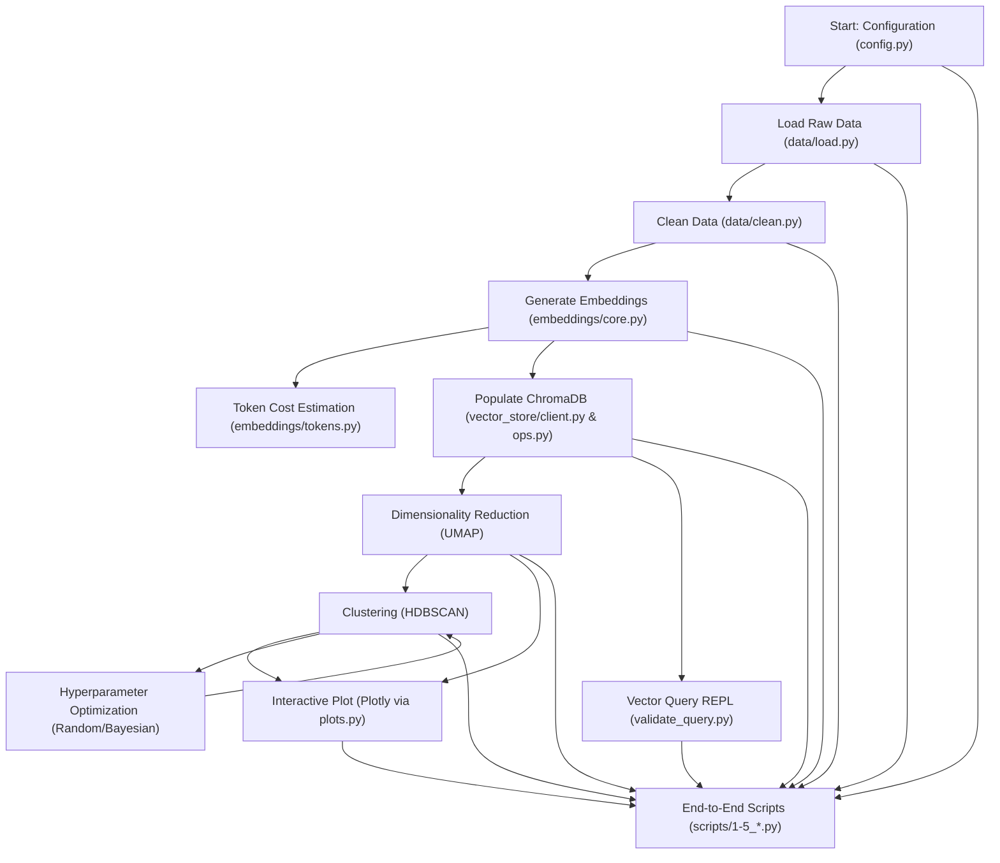

# Helpdesk Email Clustering Project

A modular Python toolkit for preprocessing, embedding, clustering, and visualizing textual datasets using Azure OpenAI embeddings, ChromaDB, UMAP, and HDBSCAN. It supports multiple datasets with distinct schemas through a centralized configuration.

---



## Table of Contents

- [Helpdesk Email Clustering Project](#helpdesk-email-clustering-project)
  - [Table of Contents](#table-of-contents)
  - [General Overview](#general-overview)
  - [Project Structure](#project-structure)
  - [Usage Manual](#usage-manual)
    - [Prerequisites](#prerequisites)
    - [Workflow Scripts](#workflow-scripts)
    - [Full Pipeline](#full-pipeline)
  - [Implementation Details](#implementation-details)
    - [1. Configuration Module (`src/config.py`)](#1-configuration-module-srcconfigpy)
    - [2. Data Loading (`src/data/load.py`)](#2-data-loading-srcdataloadpy)
    - [3. Data Cleaning (`src/data/clean.py`)](#3-data-cleaning-srcdatacleanpy)
    - [4. Embeddings (`src/embeddings`)](#4-embeddings-srcembeddings)
      - [a. Client (`client.py`)](#a-client-clientpy)
      - [b. Core (`core.py`)](#b-core-corepy)
      - [c. Tokens (`tokens.py`)](#c-tokens-tokenspy)
    - [5. Vector Store (`src/vector_store`)](#5-vector-store-srcvector_store)
      - [a. Client (`client.py`)](#a-client-clientpy-1)
      - [b. Ops (`ops.py`)](#b-ops-opspy)
    - [6. Analysis (`src/analysis`)](#6-analysis-srcanalysis)
      - [a. Dimensionality Reduction (`dimensionality_reduction.py`)](#a-dimensionality-reduction-dimensionality_reductionpy)
      - [b. Clustering (`clustering.py`)](#b-clustering-clusteringpy)
      - [c. Optimization (`optimization.py`)](#c-optimization-optimizationpy)
    - [7. Visualization (`src/visualization/plots.py`)](#7-visualization-srcvisualizationplotspy)
    - [8. Utilities (`src/utils/helpers.py`)](#8-utilities-srcutilshelperspy)
  - [Environment Setup](#environment-setup)
  - [Contributing](#contributing)
  - [License](#license)

---

## General Overview

The Helpdesk Email Clustering Project provides a reusable pipeline to transform raw text data into actionable clusters and interactive visualizations. Key capabilities include:

1. **Data Ingestion & Cleaning**: Flexibly load and clean raw data according to dataset-specific rules.
2. **Embedding Generation**: Leverage Azure OpenAI to convert text into vector representations.
3. **Vector Store Management**: Persist embeddings and metadata in ChromaDB for efficient retrieval and querying.
4. **Dimensionality Reduction & Clustering**: Apply UMAP for visualization-friendly embeddings and HDBSCAN for density-based clustering.
5. **Visualization**: Produce interactive Plotly charts to explore cluster structures.
6. **Hyperparameter Optimization**: Automate tuning of UMAP and HDBSCAN parameters via Random Search or Bayesian TPE.
7. **Interactive Querying**: Validate vector store contents by running free-text queries against stored embeddings.

All functionality is organized into a clean `src/` library, with high-level workflows orchestrated by lightweight `scripts/`.

---

## Project Structure

```txt
D4-Helpdesk/
├── data/
│   ├── raw/                 # Raw CSV or JSON exports per dataset
│   ├── processed/           # Cleaned datasets
│   └── vector_store/        # ChromaDB directories and hyperopt results
├── notebooks/               # Jupyter notebooks for exploration (optional)
├── src/                     # Core library modules
│   ├── config.py            # Centralized configuration & environment loading
│   ├── data/
│   │   ├── load.py          # Raw data loading functions
│   │   └── clean.py         # Generalized cleaning utilities
│   ├── embeddings/
│   │   ├── client.py        # Azure OpenAI client setup
│   │   ├── core.py          # Embedding generation logic
│   │   └── tokens.py        # Token counting & cost estimation
│   ├── vector_store/
│   │   ├── client.py        # ChromaDB client & collection helpers
│   │   └── ops.py           # Add, query, fetch-all operations
│   ├── analysis/
│   │   ├── dimensionality_reduction.py  # UMAP wrapper
│   │   ├── clustering.py    # HDBSCAN wrapper & scoring
│   │   └── optimization.py  # Hyperparameter search logic
│   ├── visualization/
│   │   └── plots.py         # Plotly-based interactive plotting
│   └── utils/
│       └── helpers.py       # Miscellaneous helpers (IO, formatting)
├── scripts/                 # Entry-point workflows
│   ├── 1_clean_data.py      # Data cleaning pipeline
│   ├── 2_embed_data.py      # Embedding & vector store population
│   ├── 3_visualize_clusters.py  # UMAP + HDBSCAN & interactive plots
│   ├── 4_optimize_clusters.py   # Hyperparameter tuning for clustering
│   └── 5_validate_query.py      # Interactive vector store querying
├── .env                     # Environment variables (API keys, endpoints)
├── requirements.txt         # Python dependencies
└── README.md                # Project overview and instructions
```

---

## Usage Manual

### Prerequisites

1. Clone the repository and `cd` into the project root.
2. Install dependencies:

   ```powershell
   pip install -r requirements.txt
   ```

3. Create a `.env` file in the root with the following keys:

   ```dotenv
   AZURE_OPENAI_API_KEY=your_api_key_here
   AZURE_OPENAI_ENDPOINT=https://your-resource.openai.azure.com/
   AZURE_OPENAI_EMBED_DEPLOYMENT=your_deployment_name
   ACTIVE_DATASET=helpdesk          # Default dataset to run
   ```

### Workflow Scripts

All scripts accept a required `--dataset <dataset_name>` argument to select the configuration. Use `--help` to view full options.

1. **Clean Data**

   ```powershell
   python .\scripts\1_clean_data.py --dataset helpdesk
   ```

   - Loads raw files matching `raw_path_pattern`.
   - Applies cleaning steps defined in config.
   - Saves cleaned CSV to `data/processed/`.

2. **Embed Data & Populate Vector Store**

   ```powershell
   python .\scripts\2_embed_data.py --dataset helpdesk
   ```

   - Reads cleaned CSV.
   - Generates embeddings via Azure OpenAI.
   - Logs token counts & cost estimates.
   - Upserts embeddings, metadata, and documents into ChromaDB.

3. **Visualize Clusters**

   ```powershell
   python .\scripts\3_visualize_clusters.py --dataset helpdesk --dimensions 2 --color_by cluster_label
   ```

   - Fetches embeddings & metadata from ChromaDB.
   - Reduces to 2D or 3D with UMAP.
   - Optionally re-clusters with HDBSCAN for coloring.
   - Produces an interactive Plotly HTML in `plots/`.

4. **Optimize Clustering Hyperparameters**

   ```powershell
   python .\scripts\4_optimize_clusters.py --dataset helpdesk --method bayesian --evals 50
   ```

   - Loads embeddings.
   - Runs Random Search or Bayesian TPE on UMAP/HDBSCAN.
   - Saves tuning results CSV to `data/vector_store/hyperopt/`.

5. **Validate Vector Store Query**

   ```powershell
   python .\scripts\5_validate_query.py --dataset helpdesk --results 5
   ```

   - Launches an interactive REPL.
   - Enter free-text queries to retrieve top-k similar documents.
   - Displays source text, metadata, and relevance scores.

### Full Pipeline

To run everything end-to-end:

```powershell
python .\scripts\1_clean_data.py --dataset helpdesk `
  ; python .\scripts\2_embed_data.py --dataset helpdesk `
  ; python .\scripts\4_optimize_clusters.py --dataset helpdesk `
  ; python .\scripts\3_visualize_clusters.py --dataset helpdesk
``` 

Or use a PowerShell chain/script to orchestrate those commands.

---

## Implementation Details

### 1. Configuration Module (`src/config.py`)

- Centralizes environment-variable loading via `python-dotenv`.
- Defines global paths (`data/raw`, `data/processed`, `vector_store`, `hyperopt_results`).
- Houses `DATASET_CONFIGS` dict for per-dataset schema:
  - File patterns, column names, cleaning steps.
  - Vector store paths & collection names.
  - Embedding & optimization parameters.
- Provides `get_active_config(dataset_name)` to retrieve the active dataset settings.

### 2. Data Loading (`src/data/load.py`)

- `load_raw_data(file_paths: List[Path], columns_to_load: Optional[List[str]]) -> pd.DataFrame`
  - Reads CSV or JSON files.
  - Selects only configured columns.
  - Concatenates multiple sources.

### 3. Data Cleaning (`src/data/clean.py`)

- Generic cleaning functions:
  - `clean_custom_fields` (rename/remove specified columns).
  - `filter_by_column_value` (e.g., language filtering).
  - `filter_related_issues` (drop rows with missing relations).
  - `clean_text_column`, `clean_and_filter_summary` (remove signatures, headers, noise). 
- Each step is driven by the ordered `cleaning_steps` in the dataset config.

### 4. Embeddings (`src/embeddings`)

#### a. Client (`client.py`) 
- Builds an authenticated Azure OpenAI client using config keys. 

#### b. Core (`core.py`)

- `generate_embeddings_batch(texts: List[str], client, **kwargs) -> List[List[float]]`
- Handles batching, retries, and logs progress.

#### c. Tokens (`tokens.py`)
- `get_token_stats(texts: List[str])` uses `tiktoken` to count tokens & estimate cost per embedding.

### 5. Vector Store (`src/vector_store`)

#### a. Client (`client.py`)
- `get_chroma_client(path: Path) -> chromadb.PersistentClient`
- `get_or_create_collection(client, name, metadata=None)`
  - Ensures the named collection exists with its embedding function.

#### b. Ops (`ops.py`)
- `prepare_chroma_data(df, id_column, text_column, metadata_columns) -> (documents, metadatas, ids)`
- `get_all_data(collection, include=[...]) -> pd.DataFrame`
- `query_collection(collection, query_texts, n_results, include) -> Dict`

### 6. Analysis (`src/analysis`)

#### a. Dimensionality Reduction (`dimensionality_reduction.py`)
- Wraps `umap.UMAP` with an availability check.
- `reduce_dimensions_umap(embeddings, params, random_state) -> np.ndarray`

#### b. Clustering (`clustering.py`)
- Wraps `hdbscan.HDBSCAN` with `prediction_data=True`.
- `cluster_hdbscan(embeddings, params) -> np.ndarray`
- `score_clusters(clusterer, prob_threshold, label_lower_bound, label_upper_bound) -> float`

#### c. Optimization (`optimization.py`)
- Defines the `_objective_function` combining UMAP + HDBSCAN.
- Exposes `run_hyperparameter_search(...)` supporting:
  - **Random Search**: Simple sampling over lists/ranges.
  - **Bayesian TPE**: Via `hyperopt.fmin` and `tpe.suggest`.
- Returns a `DataFrame` (random) or `Trials` object (bayesian).

### 7. Visualization (`src/visualization/plots.py`)

- Provides `plot_embeddings_interactive(...)` using Plotly.
  - Supports 2D/3D scatter, coloring, symbols, hover metadata.
  - Optional outlier filtering and HTML export.

### 8. Utilities (`src/utils/helpers.py`)

- `save_dataframe(df, output_path, index=False) -> bool`
- `save_hyperopt_results(results, tuning_method, num_evals, output_dir) -> Path`
- `format_metadata_for_display(metadata_dict, relevant_fields) -> str`

---

## Environment Setup

1. Copy `.env.example` to `.env` and fill in your Azure and dataset settings.
2. Create a Python 3.8+ virtual environment.
3. Install packages:

   ```powershell
   pip install -r requirements.txt
   ```

---

## Contributing

Contributions are welcome! Please open issues or submit pull requests with clear descriptions. Adhere to existing code style and document new functionality.

---

## License

This project is licensed under the MIT License. See [LICENSE](LICENSE) for details. 